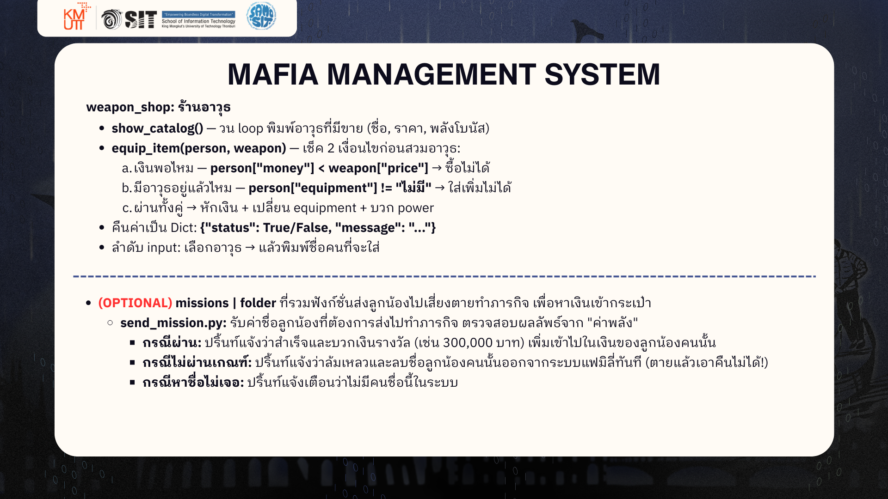

# 🕴️ MAFIA MANAGEMENT SYSTEM — Final Project (โหมด HARD 🔥)

โปรเจกต์กลุ่ม | ต้องใช้ GitHub ทำงานร่วมกัน

> เวอร์ชันนี้สำหรับกลุ่มที่มั่นใจ — **ไม่มีโครง `def` ให้ ไม่มี hint** มีแค่ `import` กับโจทย์สั้น ๆ ในคอมเมนต์ ต้องออกแบบฟังก์ชันเองทั้งหมด

## กติกาสำคัญที่สุด ⚠️

> **1 คน = 1 ไฟล์ = 1 ฟังก์ชัน — ห้ามแก้ไฟล์ของเพื่อนเด็ดขาด!**
> `data.py` เขียนให้แล้ว ห้ามแก้ | `main.py` เป็นไฟล์ของหัวหน้ากลุ่มคนเดียว

## ⏱️ งานแรกของทุกคน— สำคัญมาก!

เวอร์ชันนี้ `main.py` จะ **รันไม่ได้เลย** จนกว่าทุกไฟล์จะมีฟังก์ชันของตัวเองครบ (เพราะ `main.py` ไป `import` ทุกฟังก์ชัน ถ้าไฟล์ไหนยังไม่มีฟังก์ชัน = error ทั้งโปรแกรม)

ดังนั้นก่อนลงมือเขียน logic ให้ทุกคน **สร้างโครงฟังก์ชันเปล่าของตัวเองก่อน** แล้ว push ทันที เช่น:

```python
def add_member(name, age, power, money):
    pass
```

พอทุกคน push ครบ → `python main.py` จะรันได้ → แล้วค่อยแยกย้ายไปเขียน logic จริงในฟังก์ชันตัวเอง
(นี่คือการฝึก git จริง: ทุกคนได้ commit + push + pull ตั้งแต่ 15 นาทีแรก)

## วิธีทดสอบ

แต่ละไฟล์มีบล็อกทดสอบ (`if __name__ == "__main__":`) พร้อมเฉลยคำตอบที่ควรได้ในคอมเมนต์ รันเช็คงานตัวเองได้เลย:

```bash
python -m personnel.add_member      # (เปลี่ยนเป็นโฟลเดอร์.ชื่อไฟล์ของตัวเอง ไม่ต้องมี .py)
```

ทดสอบทั้งระบบ:

```bash
python main.py
```
---
  ## workshop detail

  .png)

  

  .png)
